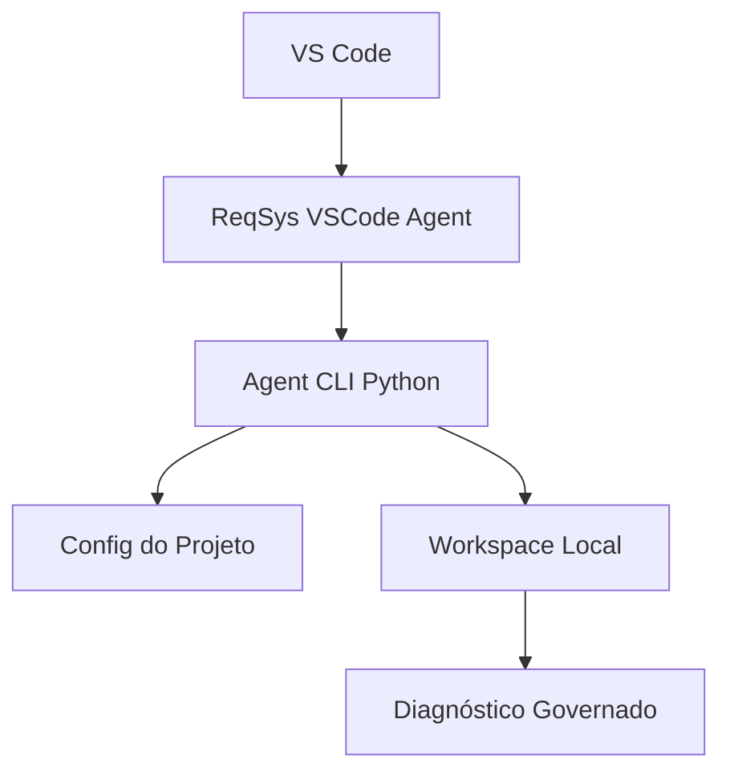

# Arquitetura

## Decisão

Separar o plugin VS Code em repositório próprio e deixar os projetos consumidores com apenas um arquivo de configuração.

## Fluxo

## Contrato do projeto consumidor

O projeto consumidor deve fornecer um arquivo JSON com:

- nome do projeto;
- modo de execução;
- diretórios permitidos;
- ações bloqueadas;
- política de evidência.

## Limites

- O plugin não substitui CI.
- O plugin não altera branch principal.
- O plugin não executa automações destrutivas.
- O plugin não deve ser parte obrigatória do build do produto.
